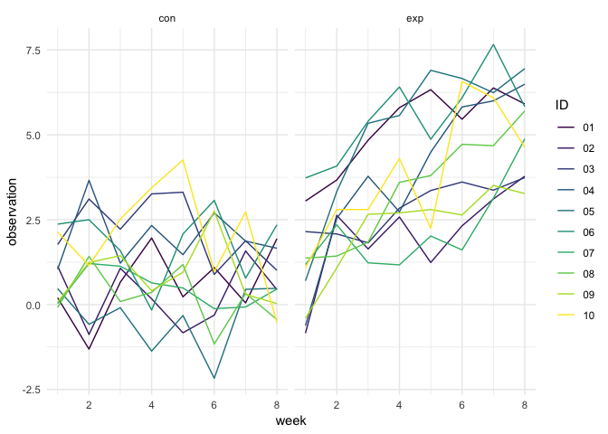

P8105\_hw5\_qs2200
================
Qi Shao
11/6/2018

Problem 1
---------

### Dataframe contains file names

``` r
zip_file = tibble(file_name = list.files("./data"))
zip_file
```

    ## # A tibble: 20 x 1
    ##    file_name 
    ##    <chr>     
    ##  1 con_01.csv
    ##  2 con_02.csv
    ##  3 con_03.csv
    ##  4 con_04.csv
    ##  5 con_05.csv
    ##  6 con_06.csv
    ##  7 con_07.csv
    ##  8 con_08.csv
    ##  9 con_09.csv
    ## 10 con_10.csv
    ## 11 exp_01.csv
    ## 12 exp_02.csv
    ## 13 exp_03.csv
    ## 14 exp_04.csv
    ## 15 exp_05.csv
    ## 16 exp_06.csv
    ## 17 exp_07.csv
    ## 18 exp_08.csv
    ## 19 exp_09.csv
    ## 20 exp_10.csv

### Read data

``` r
read_file = function(x){
  
  x = str_c("./data/", x)
  read_csv(x)
  
}

zip_file = 
  zip_file %>%
  mutate(data = map(zip_file$file_name, read_file))
```

### Tidy data

``` r
zip_file = 
  unnest(zip_file) %>%
  separate(file_name, into =c("arm", "id"), sep = "_") %>%
  separate(id, into =c("id", "other"), sep = ".csv") %>%
  gather(key = week, value = observation, week_1:week_8) %>%
  separate(week, into = c("rm", "week"), sep = "_") %>%
  select(-other, -rm )
```

### Make a spaghetti plot

``` r
zip_file %>%
  mutate(week = as.numeric(week))%>%
  ggplot(aes(x = week, y = observation, color = id)) +
  geom_line()+
  facet_grid(~arm)+
  viridis::scale_color_viridis(
    name = "ID", 
    discrete = TRUE
  )+
  theme_minimal() 
```


